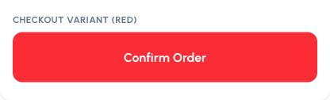

# Order Button

Animated order/add-to-cart button with a truck-delivery micro-interaction. Controlled via `isProcessing`, disabled while processing, `aria-busy` + `aria-live` announcements, `prefers-reduced-motion` support.

[](https://github.com/masumislambadsha/components/stargazers)
[](https://data.jsdelivr.com/v1/stats/packages/gh/masumislambadsha/components)



Live on Uiverse: https://uiverse.io/masumislambadsha/light-chicken-94

## Install (shadcn-compatible registry)

```bash
npx shadcn@latest add https://cdn.jsdelivr.net/gh/masumislambadsha/components@main/Order%20Button/registry/order-button.json
```

Or copy the single file [`OrderButton.jsx`](OrderButton.jsx) into your project — React + Tailwind only, no other dependencies.

> Maintenance: the shadcn CLI does not fetch remote file URLs, so the
> component source is inlined in `registry/order-button.json`. After **every**
> edit to `OrderButton.jsx`, re-run `node registry/sync.mjs` (from this
> folder) and commit the regenerated JSON — otherwise installs ship stale code.

## Usage

```jsx
import OrderButton from "./OrderButton";

const [busy, setBusy] = useState(false);

<OrderButton
  onClick={() => {
    setBusy(true);
    setTimeout(() => setBusy(false), 6000);
  }}
  isProcessing={busy}
  defaultLabel="Confirm Order"
  successLabel="Order Placed"
/>
```

Props: `onClick`, `isProcessing`, `disabled`, `defaultLabel`, `successLabel`,
`variant` (`dark`/`primary`/`red`/`amber`/`accent`), `size` (`sm`/`md`/`lg`),
`durationMs` (default `6000`), `type`, `className`, `style`, `ariaLabel`.

While processing, the background switches to gray (like an add-to-cart confirmation) and the button is disabled to prevent double submits.

## Variants in this folder

| Path | For |
| ---- | --- |
| `OrderButton.jsx` | Canonical version (React + Tailwind, JS) |
| `ports/magicui/order-button.tsx` | TypeScript port (`forwardRef`, typed props) — shadcn/MagicUI-style projects |
| `ports/heroui/OrderButton.tsx` | HeroUI-style port (`tailwind-variants` `tv()` config) |
| `ports/react-bits/` | CSS-Modules variant (`OrderButton.jsx` + `OrderButton.module.css`, no Tailwind needed for the animation) |
| `uiverse/` | Pure HTML + CSS version (checkbox hack, no JS) for uiverse.io submits |
| `uiverse/tailwind/` | Tailwind version for uiverse.io (utilities in HTML, keyframes + triggers in CSS) |
| `registry/order-button.json` | shadcn registry definition pointing at the canonical file |
